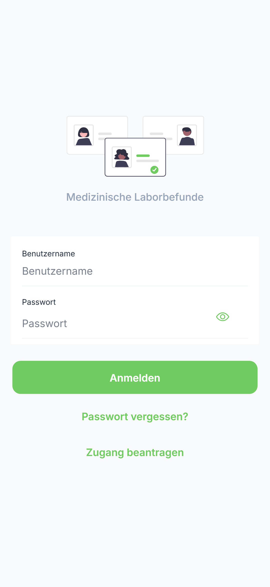
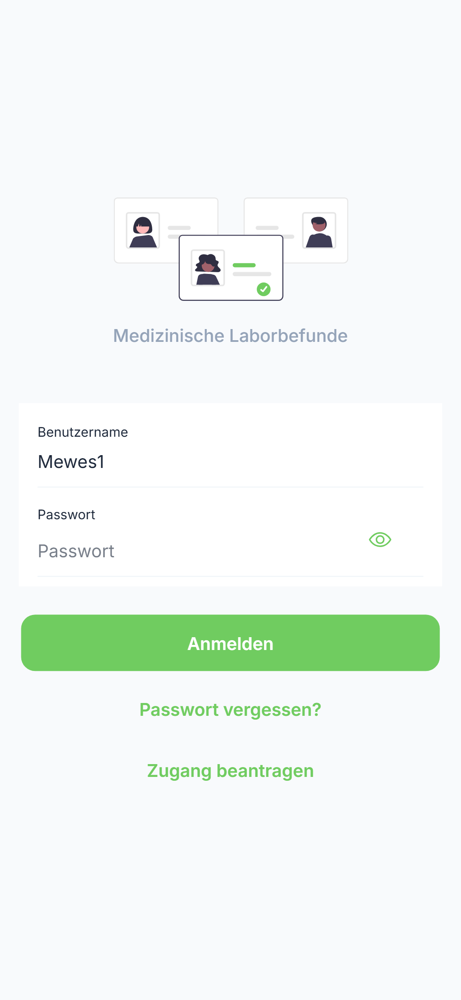
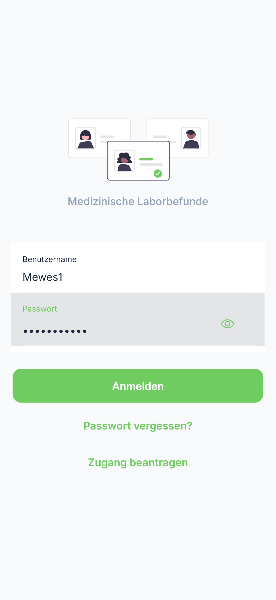

# Anmeldung

Diese Anleitung zeigt Ihnen Schritt für Schritt, wie Sie sich bei der labGate PWA anmelden.

---

## Voraussetzungen

Bevor Sie beginnen, stellen Sie sicher, dass Sie folgende Informationen von Ihrem Labor erhalten haben:

| Erforderlich | Beschreibung |
|--------------|--------------|
| Benutzername | Ihr persönlicher Benutzername oder E-Mail |
| Passwort | Ihr Zugangspasswort |

---

## Schritt-für-Schritt Anmeldung

### Schritt 1: App öffnen

Öffnen Sie die labGate PWA in Ihrem Browser oder starten Sie die installierte App.

{ loading=lazy }

**Benutzeraktion:** App öffnen

**Was Sie sehen:**

- Das labGate Logo
- Eingabefeld "Benutzername"
- Eingabefeld "Passwort"
- Schaltfläche "Anmelden"

---

### Schritt 2: Benutzername eingeben

Tippen Sie auf das Eingabefeld **"Benutzername"** und geben Sie Ihren Benutzernamen ein.

{ loading=lazy }

**Benutzeraktion:** Tippen auf Feld "Benutzername" → Benutzername eingeben

**Ergebnis:** Der Benutzername wird im Eingabefeld angezeigt.

!!! tip "Tipp"
    Der Benutzername ist in der Regel Ihre E-Mail-Adresse oder eine vom Labor zugewiesene Kennung.

---

### Schritt 3: Passwort eingeben

Tippen Sie auf das Eingabefeld **"Passwort"** und geben Sie Ihr Passwort ein.

{ loading=lazy }

**Benutzeraktion:** Tippen auf Feld "Passwort" → Passwort eingeben

**Ergebnis:** Das Passwort wird als Punkte (•••) angezeigt.

!!! warning "Sicherheitshinweis"
    Geben Sie Ihr Passwort niemals an Dritte weiter.

---

### Schritt 4: Anmelden

Tippen Sie auf die Schaltfläche **"Anmelden"**.

{ loading=lazy }

**Benutzeraktion:** Tippen auf Schaltfläche "Anmelden"

**Ergebnis:** Nach erfolgreicher Anmeldung werden Sie zur Befundübersicht weitergeleitet.

---

## Laborauswahl (optional)

Falls Sie Zugang zu mehreren Laboren haben, erscheint nach der Anmeldung eine Laborauswahl:

### Schritt 5: Labor auswählen

1. Die verfügbaren Labore werden in einer Liste angezeigt
2. Tippen Sie auf das gewünschte Labor
3. Sie werden zur Befundübersicht weitergeleitet

**Benutzeraktion:** Tippen auf gewünschtes Labor in der Liste

!!! info "Laborwechsel"
    Sie können das Labor jederzeit über das Seitenmenü wechseln.

---

## Angemeldet bleiben

Die App speichert Ihre Anmeldedaten sicher auf Ihrem Gerät. Sie müssen sich nicht bei jedem Öffnen erneut anmelden.

!!! info "Automatische Abmeldung"
    Aus Sicherheitsgründen werden Sie nach einer bestimmten Zeit der Inaktivität automatisch abgemeldet.

---

## Abmelden

So melden Sie sich ab:

| Schritt | Aktion |
|---------|--------|
| 1 | Öffnen Sie das Seitenmenü (☰ oben links) |
| 2 | Scrollen Sie nach unten |
| 3 | Tippen Sie auf "Abmelden" |
| 4 | Bestätigen Sie die Abmeldung |

---

## Fehlerbehebung

### Anmeldung fehlgeschlagen

| Problem | Ursache | Lösung |
|---------|---------|--------|
| Ungültige Anmeldedaten | Falscher Benutzername oder Passwort | Überprüfen Sie Ihre Eingaben |
| Keine Verbindung | Internetverbindung unterbrochen | Prüfen Sie Ihre Netzwerkverbindung |
| Account gesperrt | Zu viele Fehlversuche | Kontaktieren Sie Ihr Labor |

### Passwort vergessen?

1. Kontaktieren Sie Ihren Laboradministrator
2. Lassen Sie sich ein neues Passwort zuweisen

!!! warning "Wichtig"
    Geben Sie Ihre Zugangsdaten niemals an Dritte weiter. Die Zugangsdaten sind personenbezogen und unterliegen dem Datenschutz.

---

## Nächste Schritte

Nach erfolgreicher Anmeldung können Sie:

- [➡️ Befunde ansehen](../results/overview.md)
- [➡️ Patienten verwalten](../patients/list.md)
- [➡️ Einstellungen anpassen](../settings/general.md)
