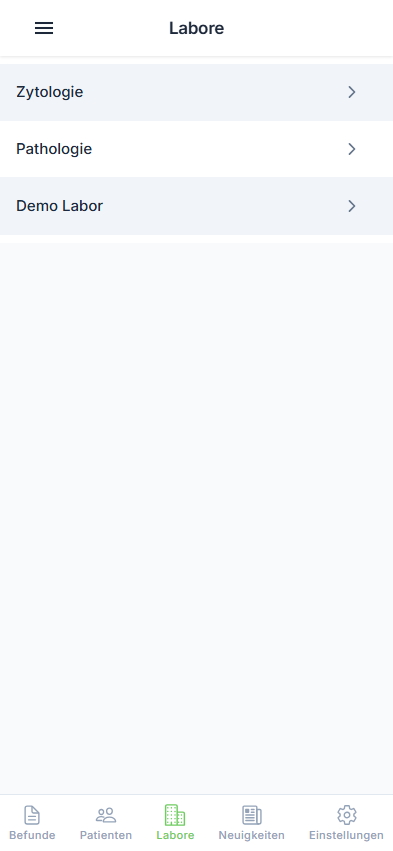
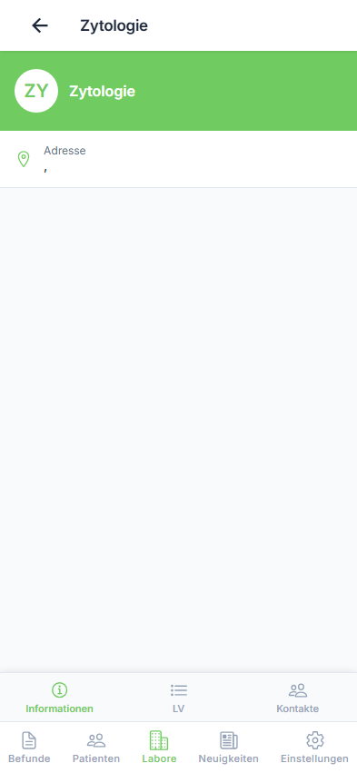
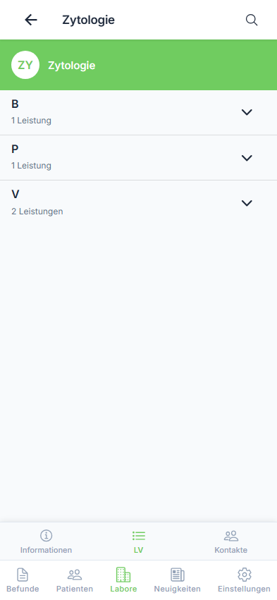
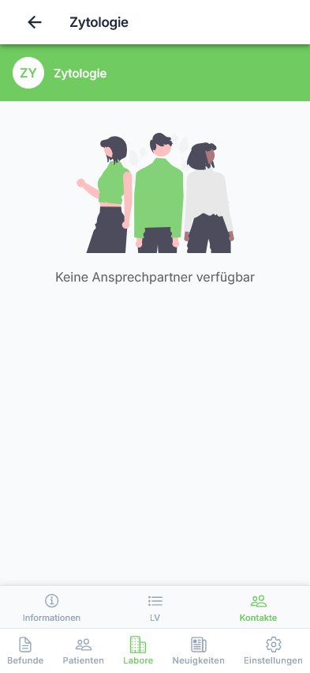

# Laborübersicht

Die Laborübersicht zeigt alle Labore, mit denen Sie verbunden sind.

---

## Schritt 1: Laborübersicht öffnen

Öffnen Sie das Seitenmenü und tippen Sie auf "Labore".

{ loading=lazy }

**Benutzeraktion:** Tippen auf "Labore" im Seitenmenü

**Was Sie sehen:**

- Liste aller verbundenen Labore
- Laborname und Standort
- Labortyp (Facharzt, Laborgemeinschaft, etc.)

---

## Laborliste

Jedes Labor wird mit folgenden Informationen angezeigt:

| Information | Beschreibung |
|-------------|--------------|
| Laborname | Offizielle Bezeichnung |
| Labortyp | z.B. Facharzt, Laborgemeinschaft, Mikrobiologie |
| Standort | Stadt/Region |

---

## Schritt 2: Labor auswählen

Tippen Sie auf ein Labor, um die Details anzuzeigen.

{ loading=lazy }

**Benutzeraktion:** Tippen auf ein Labor in der Liste

**Ergebnis:** Die Labordetails werden angezeigt.

---

## Schritt 3: Tabs wechseln

Wechseln Sie zwischen den verschiedenen Informationsbereichen.

### Info-Tab

Zeigt allgemeine Laborinformationen:

- Adresse
- Kontaktdaten
- Öffnungszeiten

### Leistungen-Tab

{ loading=lazy }

**Benutzeraktion:** Tippen auf Tab "Leistungen"

**Was Sie sehen:**

- Angebotene Analysen
- Probenanforderungen
- Spezialuntersuchungen

### Kontakte-Tab

{ loading=lazy }

**Benutzeraktion:** Tippen auf Tab "Kontakte"

**Was Sie sehen:**

- Ansprechpartner
- Telefonnummern
- E-Mail-Adressen

---

## Aktives Labor wechseln

So wechseln Sie das aktive Labor:

| Schritt | Aktion |
|---------|--------|
| 1 | Öffnen Sie das Hauptmenü (☰) |
| 2 | Tippen Sie auf "Labore" |
| 3 | Wählen Sie das gewünschte Labor |

**Benutzeraktion:** Labor in der Liste antippen

**Ergebnis:** Das Labor wird als aktiv gesetzt, Befunde werden entsprechend gefiltert.

!!! info "Hinweis"
    Nach dem Wechsel werden automatisch die Befunde des neuen Labors geladen.

---

## Verfügbare Informationen

Je nach Labor können folgende Informationen verfügbar sein:

| Information | Beschreibung |
|-------------|--------------|
| Kontaktdaten | Telefon, Fax, E-Mail |
| Ansprechpartner | Laborärzte und Mitarbeiter |
| Öffnungszeiten | Erreichbarkeit |
| Leistungskatalog | Angebotene Analysen |
| Probenanforderungen | Hinweise zur Probennahme |

---

## Mehrere Labore

Falls Sie mit mehreren Laboren verbunden sind:

- Das aktuelle Labor wird im Header angezeigt
- Befunde werden laborbezogen gefiltert
- Wechseln Sie zwischen Laboren über das Menü

---

## Nächste Schritte

- [➡️ Labordetails ansehen](details.md)
- [➡️ Leistungskatalog](services.md)
- [⬅️ Zurück zur Befundübersicht](../results/overview.md)
