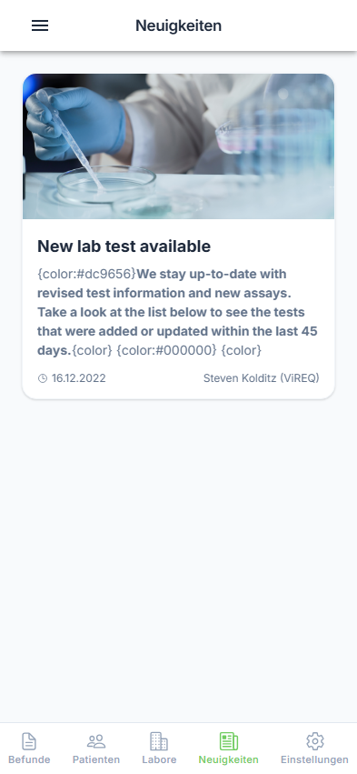
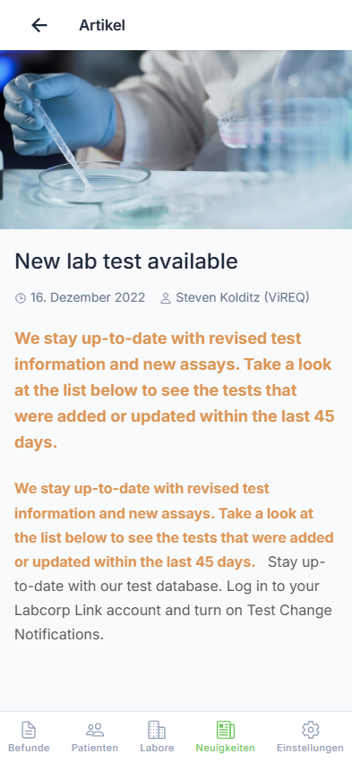

# Neuigkeiten

Der Neuigkeiten-Bereich informiert Sie über wichtige Mitteilungen und Updates.

---

## Schritt 1: Neuigkeiten öffnen

Öffnen Sie das Seitenmenü und tippen Sie auf "Neuigkeiten".

{ loading=lazy }

**Benutzeraktion:** Tippen auf "Neuigkeiten" im Seitenmenü

**Was Sie sehen:**

- Liste aller Neuigkeiten
- Vorschaubilder und Titel
- Veröffentlichungsdatum

---

## Nachrichtenliste

Jede Nachricht zeigt:

| Element | Beschreibung |
|---------|--------------|
| Bild | Vorschaubild (falls vorhanden) |
| Titel | Überschrift der Nachricht |
| Teaser | Kurze Zusammenfassung |
| Datum | Veröffentlichungsdatum |
| Autor | Verfasser der Nachricht |

### Wichtige Nachrichten

Wichtige Nachrichten sind mit einem 📌 Pin-Symbol gekennzeichnet und werden priorisiert angezeigt.

---

## Schritt 2: Nachricht öffnen

Tippen Sie auf eine Nachricht, um den vollständigen Inhalt zu lesen.

{ loading=lazy }

**Benutzeraktion:** Tippen auf eine Nachricht in der Liste

**Ergebnis:** Die Nachricht wird im Vollbild angezeigt.

---

## Schritt 3: Nachricht lesen

Scrollen Sie nach unten, um den vollständigen Inhalt zu lesen.

{ loading=lazy }

**Benutzeraktion:** Nach unten scrollen

**Was Sie sehen:**

- Vollständiger Nachrichtentext
- Bilder und Grafiken
- Links zu weiterführenden Informationen

---

## Nachrichtentypen

### Ankündigungen

Wichtige Mitteilungen des Labors:

- Änderungen bei Öffnungszeiten
- Neue Analysen im Angebot
- Wartungsarbeiten

### Gesundheitstipps

Medizinische Informationen und Hinweise:

- Saisonale Gesundheitsthemen
- Präventionsmaßnahmen
- Aktuelle Studien

### Labor-News

Neuigkeiten aus dem Labor:

- Neue Geräte und Verfahren
- Zertifizierungen
- Personaländerungen

### App-Updates

Informationen zur labGate App:

- Neue Funktionen
- Fehlerbehebungen
- Verbesserungen

---

## Markdown-Unterstützung

Nachrichteninhalte können formatiert sein:

| Format | Beispiel |
|--------|----------|
| Fettdruck | **Wichtig** |
| Kursiv | *Hinweis* |
| Listen | Aufzählungen |
| Links | Weiterführende Infos |
| Bilder | Grafiken und Fotos |

---

## Aktualisieren

Ziehen Sie die Liste nach unten (Pull-to-Refresh).

**Benutzeraktion:** Liste nach unten ziehen und loslassen

**Ergebnis:** Neue Nachrichten werden geladen.

---

## Infinite Scroll

Scrollen Sie nach unten, um ältere Nachrichten zu laden.

**Benutzeraktion:** Liste bis zum Ende scrollen

**Ergebnis:** Weitere Nachrichten werden automatisch nachgeladen.

!!! tip "Tipp"
    Aktivieren Sie Push-Benachrichtigungen, um über wichtige Neuigkeiten sofort informiert zu werden.

---

## Nächste Schritte

- [⬅️ Zurück zur Befundübersicht](../results/overview.md)
- [➡️ Einstellungen](../settings/general.md)
