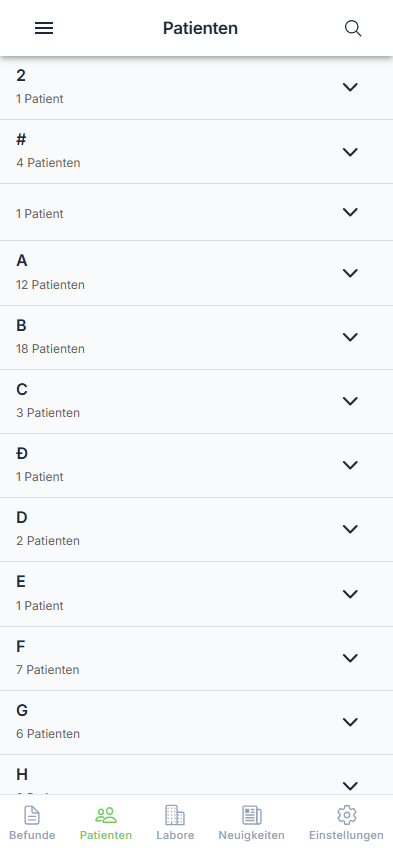
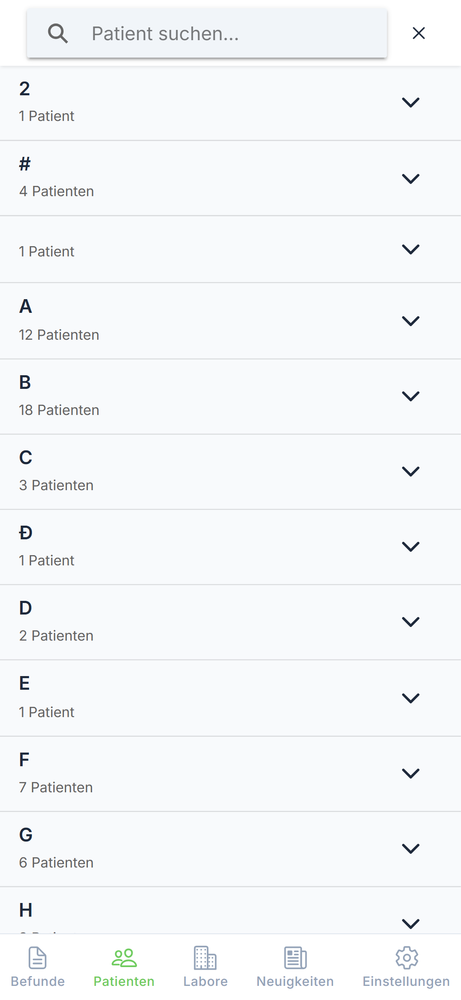

# Patientenliste

Die Patientenliste zeigt alle Patienten, für die Befunde vorliegen.

---

## Schritt 1: Patientenliste öffnen

Öffnen Sie das Seitenmenü und tippen Sie auf "Patienten".

{ loading=lazy }

**Benutzeraktion:** Tippen auf "Patienten" im Seitenmenü

**Was Sie sehen:**

- Alphabetisch sortierte Patientenliste
- Gruppierung nach Anfangsbuchstaben
- Suchsymbol (🔍) in der Kopfzeile

---

## Übersicht

Die Patienten werden alphabetisch nach Nachnamen sortiert und in aufklappbaren Gruppen angezeigt.

### Alphabetische Gruppierung

| Gruppe | Inhalt |
|--------|--------|
| **A** | Alle Patienten mit Nachnamen beginnend mit A |
| **B** | Alle Patienten mit Nachnamen beginnend mit B |
| **...** | Weitere Buchstaben |

### Patienteninformationen

Jeder Eintrag zeigt:

| Information | Beschreibung |
|-------------|--------------|
| Name | Nachname, Vorname |
| Geburtsdatum | Format: TT.MM.JJJJ |
| Alter | In Jahren (z.B. "45 J.") |
| Geschlecht | ♂ männlich, ♀ weiblich, ⚧ divers |

---

## Schritt 2: Gruppe öffnen

Tippen Sie auf eine Buchstabengruppe, um die Patienten anzuzeigen.

{ loading=lazy }

**Benutzeraktion:** Tippen auf Buchstabengruppe (z.B. "M")

**Ergebnis:** Die Gruppe klappt auf und zeigt alle Patienten mit diesem Anfangsbuchstaben.

---

## Schritt 3: Patient auswählen

Tippen Sie auf einen Patienten, um dessen Befunde anzuzeigen.

{ loading=lazy }

**Benutzeraktion:** Tippen auf einen Patienteneintrag

**Ergebnis:** Die Befundliste des Patienten wird angezeigt.

---

## Suche

### Schritt 1: Suche öffnen

Tippen Sie auf das Lupensymbol (🔍) in der Kopfzeile.

{ loading=lazy }

**Benutzeraktion:** Tippen auf 🔍 in der Kopfzeile

**Ergebnis:** Das Suchfeld wird eingeblendet.

### Schritt 2: Suchbegriff eingeben

Geben Sie den Namen des Patienten ein.

**Benutzeraktion:** Namen in das Suchfeld eingeben

### Suchkriterien

| Kriterium | Beispiel |
|-----------|----------|
| Nachname | "Müller" |
| Vorname | "Hans" |
| Kombiniert | "Müller Hans" |

### Schritt 3: Suche beenden

Tippen Sie auf das X-Symbol.

**Benutzeraktion:** Tippen auf X-Symbol

**Ergebnis:** Die vollständige Patientenliste wird wieder angezeigt.

---

## Aktualisieren

Ziehen Sie die Liste nach unten (Pull-to-Refresh), um die Patientendaten zu aktualisieren.

**Benutzeraktion:** Liste nach unten ziehen und loslassen

**Ergebnis:** Die Patientenliste wird neu geladen.

---

## Fehlerbehebung

### Leere Liste

Falls keine Patienten angezeigt werden:

| Problem | Lösung |
|---------|--------|
| Suchfilter aktiv | Suche beenden (X tippen) |
| Nicht angemeldet | Erneut anmelden |
| Keine Daten | Liste aktualisieren |

!!! info "Datenschutz"
    Die Patientenliste zeigt nur Patienten an, für die Sie als Einsender Befunde erhalten haben. Der Zugriff auf Patientendaten ist durch Ihre Berechtigungen eingeschränkt.

---

## Nächste Schritte

- [➡️ Patientendetails ansehen](details.md)
- [⬅️ Zurück zur Befundübersicht](../results/overview.md)
