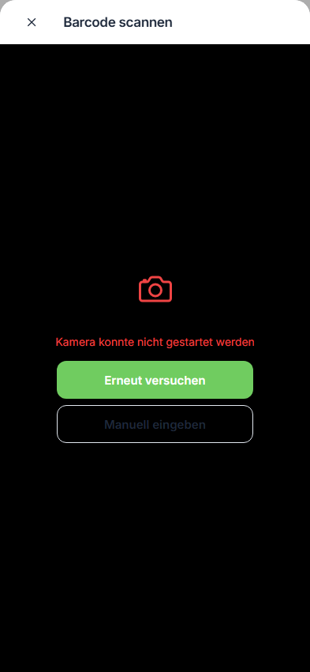
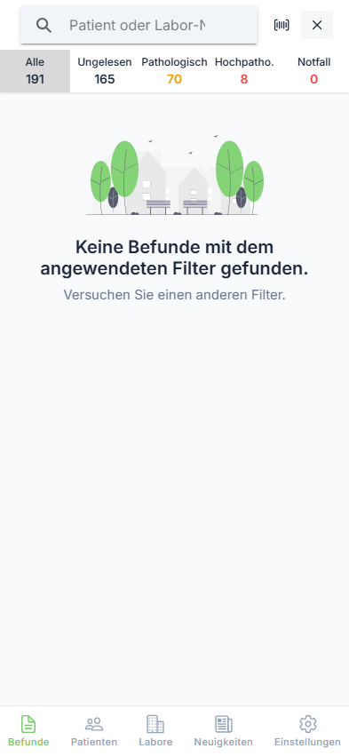

# Filter & Suche

Nutzen Sie die Filter- und Suchfunktionen, um Befunde schnell zu finden.

---

## Textsuche

### Schritt 1: Suche öffnen

Tippen Sie auf das Lupensymbol (🔍) in der Kopfzeile.

**Benutzeraktion:** Tippen auf 🔍 in der Kopfzeile

**Ergebnis:** Das Suchfeld wird eingeblendet.

---

### Schritt 2: Suchbegriff eingeben

Geben Sie Ihren Suchbegriff ein.

**Benutzeraktion:** Suchbegriff in das Textfeld eingeben

### Suchkriterien

Sie können suchen nach:

| Kriterium | Beispiel |
|-----------|----------|
| Patientenname | "Müller" oder "Hans" |
| Labor-Nummer | "L12345" oder "12345" |
| Geburtsdatum | "01.05.1980" |

---

## Barcode-Scanner

### Schritt 1: Scanner öffnen

Tippen Sie in der Suchleiste auf das Barcode-Symbol (📷).

{ loading=lazy }

**Benutzeraktion:** Tippen auf Barcode-Symbol 📷

**Ergebnis:** Die Kameraansicht wird geöffnet.

---

### Schritt 2: Barcode scannen

Richten Sie die Kamera auf den Barcode.

**Benutzeraktion:** Kamera auf Barcode ausrichten

**Ergebnis:** Der Befund wird automatisch gesucht und angezeigt.

!!! tip "Tipp"
    Der Barcode-Scanner funktioniert mit Labor-Barcodes auf Anforderungsscheinen oder Probenröhrchen.

---

## Filter verwenden

### Schritt 1: Filtermenü öffnen

Tippen Sie auf das Trichter-Symbol in der Kopfzeile.

{ loading=lazy }

**Benutzeraktion:** Tippen auf Trichter-Symbol (⚙️) in der Kopfzeile

**Ergebnis:** Das Filtermenü wird als Modal angezeigt.

---

### Schritt 2: Filter auswählen

Wählen Sie die gewünschten Filter aus.

**Benutzeraktion:** Tippen auf Filteroptionen zum Aktivieren/Deaktivieren

### Verfügbare Filter

#### Nur gemerkte Befunde
Zeigt nur als Favorit markierte Befunde (⭐).

#### Befundtyp

| Filter | Beschreibung |
|--------|--------------|
| Endbefund | Vollständig validierte Befunde |
| Teilbefund | Befunde mit ausstehenden Analysen |
| Vorläufiger Befund | Noch nicht validierte Befunde |
| Nachforderung | Zusätzlich angeforderte Analysen |
| Archivbefund | Ältere, archivierte Befunde |

#### Laborkategorie

| Filter | Beschreibung |
|--------|--------------|
| Facharzt | Befunde von Fachärzten |
| Laborgemeinschaft | Befunde aus Laborgemeinschaften |
| Mikrobiologie | Mikrobiologische Befunde |

---

### Schritt 3: Filter anwenden

Schließen Sie das Filtermenü.

**Benutzeraktion:** Tippen auf X oder außerhalb des Modals

**Ergebnis:** Die gefilterte Befundliste wird angezeigt.

---

### Schritt 4: Filter zurücksetzen

Tippen Sie auf "Alle Filter zurücksetzen", um alle aktiven Filter zu entfernen.

**Benutzeraktion:** Tippen auf "Alle Filter zurücksetzen"

**Ergebnis:** Alle Filter werden deaktiviert, die vollständige Liste wird angezeigt.

---

## Kategorien-Tabs

Die schnelle Kategoriefilterung erfolgt über die Tabs unterhalb der Kopfzeile:

| Tab | Funktion |
|-----|----------|
| Alle | Keine Kategorie-Filterung |
| Ungelesen | Nur ungelesene Befunde |
| Pathologisch | Befunde mit pathologischen Werten |
| Hochpatho. | Hochpathologische Befunde |
| Notfall | Notfallbefunde |

**Benutzeraktion:** Tippen auf gewünschten Tab

---

## Zeitraum ändern

Der aktuelle Zeitraum wird im Titel angezeigt:

- "Befunde - Heute"
- "Befunde - Letzten 7 Tage"
- "Befunde - Letzten 30 Tage"
- "Befunde - Alle"
- "Befunde - Archiv"

Den Zeitraum können Sie im Seitenmenü unter "Einstellungen" ändern.

---

## Tipps für effektive Suche

| Tipp | Beschreibung |
|------|--------------|
| 1. Kombinieren | Nutzen Sie mehrere Filter gleichzeitig |
| 2. Barcode | Schnellster Weg bei bekannter Labor-Nummer |
| 3. Kategorien | Grenzen Sie erst die Kategorie ein, dann suchen |
| 4. Zeitraum | Schränken Sie den Zeitraum ein bei vielen Befunden |

---

## Nächste Schritte

- [⬅️ Zurück zur Befundübersicht](overview.md)
- [➡️ Befunddetails ansehen](details.md)
