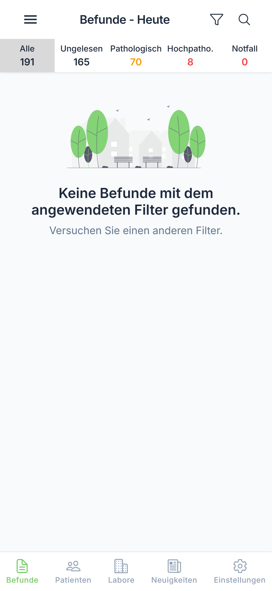
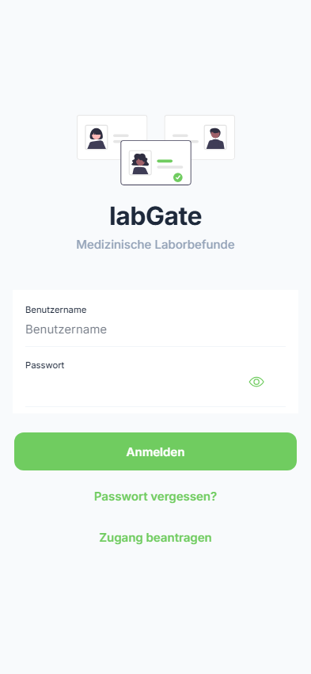

# Befundübersicht

Die Befundübersicht ist der zentrale Bereich der labGate App, in dem Sie alle Ihre Laborbefunde einsehen können.

---

## Schritt 1: Befundübersicht öffnen

Nach der Anmeldung wird automatisch die Befundübersicht angezeigt.

{ loading=lazy }

**Benutzeraktion:** Automatisch nach Anmeldung oder Tippen auf "Befunde" im Menü

**Was Sie sehen:**

- Liste aller aktuellen Befunde
- Filterleiste oben (Alle, Ungelesen, Pathologisch, etc.)
- Such-Symbol (🔍) in der Kopfzeile
- Filter-Symbol (Trichter) in der Kopfzeile

---

## Befundliste

Jeder Eintrag in der Liste enthält:

| Element | Beschreibung |
|---------|--------------|
| Patientenname | Vor- und Nachname des Patienten |
| Labor-Nummer | Eindeutige Kennung des Befunds (LabNo) |
| Datum | Datum des Befunds |
| Status | Aktueller Bearbeitungsstand |
| Indikatoren | Farbliche Markierung bei pathologischen Werten |

---

## Schritt 2: Kategorien filtern

Tippen Sie auf die Kategorien-Tabs, um Befunde zu filtern.

**Benutzeraktion:** Tippen auf gewünschten Tab

### Verfügbare Kategorien

| Tab | Beschreibung |
|-----|--------------|
| **Alle** | Zeigt alle Befunde im ausgewählten Zeitraum |
| **Ungelesen** | Nur Befunde, die noch nicht geöffnet wurden |
| **Pathologisch** | Befunde mit Werten außerhalb des Normbereichs (🟠) |
| **Hochpatho.** | Befunde mit stark abweichenden Werten (🔴) |
| **Notfall** | Dringende Befunde, die sofortige Aufmerksamkeit erfordern |

---

## Schritt 3: Befund auswählen

Tippen Sie auf einen Befund in der Liste, um die Details anzuzeigen.

{ loading=lazy }

**Benutzeraktion:** Tippen auf einen Befund in der Liste

**Ergebnis:** Die Befunddetails werden angezeigt.

!!! info "Automatisch als gelesen markiert"
    Wenn Sie einen Befund öffnen, wird dieser automatisch als "gelesen" markiert.

---

## Visuelle Indikatoren

Befunde werden mit farblichen Markierungen versehen:

| Farbe | Bedeutung |
|-------|-----------|
| 🟢 Grün/Keine | Alle Werte im Normbereich |
| 🟠 Orange | Pathologische Werte vorhanden |
| 🔴 Rot | Hochpathologische oder Notfall-Werte |
| 📌 Pin | Als Favorit markiert |

---

## Zeitraumfilter

Der angezeigte Zeitraum kann über das Filtermenü eingestellt werden:

| Zeitraum | Beschreibung |
|----------|--------------|
| Heute | Nur Befunde von heute |
| Letzte 7 Tage | Befunde der letzten Woche |
| Letzte 30 Tage | Befunde des letzten Monats |
| Alle | Alle verfügbaren Befunde |
| Archiv | Ältere, archivierte Befunde |

---

## Nächste Schritte

- [➡️ Befunddetails ansehen](details.md)
- [➡️ Filter & Suche verwenden](filter-search.md)
