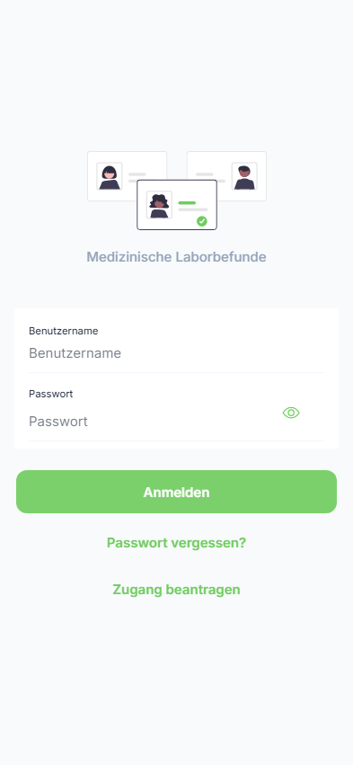
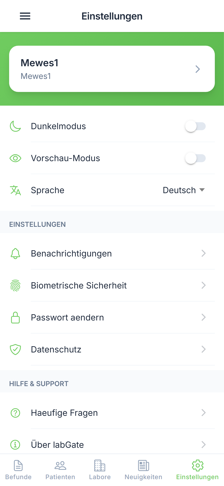

# Allgemeine Einstellungen

Passen Sie die labGate App an Ihre Bedürfnisse an.

---

## Schritt 1: Einstellungen öffnen

Öffnen Sie das Seitenmenü und tippen Sie auf "Einstellungen".

{ loading=lazy }

**Benutzeraktion:** Tippen auf "Einstellungen" im Seitenmenü

**Was Sie sehen:**

- Befund-Einstellungen
- Darstellungsoptionen
- Konto-Informationen

---

## Schritt 2: Einstellungen anpassen

Scrollen Sie durch die Einstellungen und passen Sie diese an.

{ loading=lazy }

**Benutzeraktion:** Nach unten scrollen

**Was Sie sehen:**

- Weitere Einstellungsoptionen
- App-Informationen
- Abmelden-Option

---

## Verfügbare Einstellungen

### Befund-Zeitraum

Legen Sie fest, welcher Zeitraum standardmäßig angezeigt wird:

| Option | Beschreibung |
|--------|--------------|
| Heute | Nur Befunde von heute |
| Letzte 7 Tage | Befunde der letzten Woche |
| Letzte 30 Tage | Befunde des letzten Monats |
| Alle | Alle verfügbaren Befunde |

**Benutzeraktion:** Gewünschten Zeitraum auswählen

---

### Sprache

Die App-Sprache wird automatisch anhand Ihrer Geräteeinstellungen festgelegt.

| Sprache | Status |
|---------|--------|
| 🇩🇪 Deutsch | Verfügbar |
| 🇬🇧 Englisch | Geplant |

---

### Darstellung

#### Dark Mode

| Option | Beschreibung |
|--------|--------------|
| System | Folgt den Geräteeinstellungen |
| Hell | Immer helles Design |
| Dunkel | Immer dunkles Design |

**Benutzeraktion:** Gewünschte Option auswählen

---

### Daten & Speicher

#### Cache leeren

Löscht zwischengespeicherte Daten.

**Benutzeraktion:** Tippen auf "Cache leeren"

**Ergebnis:** Zwischengespeicherte Daten werden gelöscht.

!!! warning "Hinweis"
    Nach dem Leeren des Caches müssen alle Daten neu geladen werden.

#### Offline-Daten

Zeigt den Speicherplatz für offline verfügbare Befunde.

---

## Konto

### Aktives Labor

Zeigt das aktuell ausgewählte Labor.

**Benutzeraktion:** Tippen, um Labor zu wechseln

### Einsender-Information

Zeigt Ihre Einsendernummer und verbundene Informationen.

### Abmelden

Meldet Sie von der App ab.

| Schritt | Aktion |
|---------|--------|
| 1 | Tippen Sie auf "Abmelden" |
| 2 | Bestätigen Sie im Dialog |

**Ergebnis:** Sie werden abgemeldet und zur Anmeldeseite weitergeleitet.

!!! warning "Hinweis"
    Alle lokalen Daten werden beim Abmelden gelöscht.

---

## App-Information

### Version

Zeigt die aktuell installierte App-Version.

### Über labGate

{ loading=lazy }

Informationen über die App und den Hersteller.

**Benutzeraktion:** Tippen auf "Über labGate"

### Lizenzen

Open-Source-Lizenzen der verwendeten Bibliotheken.

---

## FAQ

{ loading=lazy }

Häufig gestellte Fragen und Antworten.

**Benutzeraktion:** Tippen auf "FAQ"

---

## Nächste Schritte

- [➡️ Benachrichtigungen](notifications.md)
- [➡️ FAQ](../help/faq.md)
- [⬅️ Zurück zur Befundübersicht](../results/overview.md)
